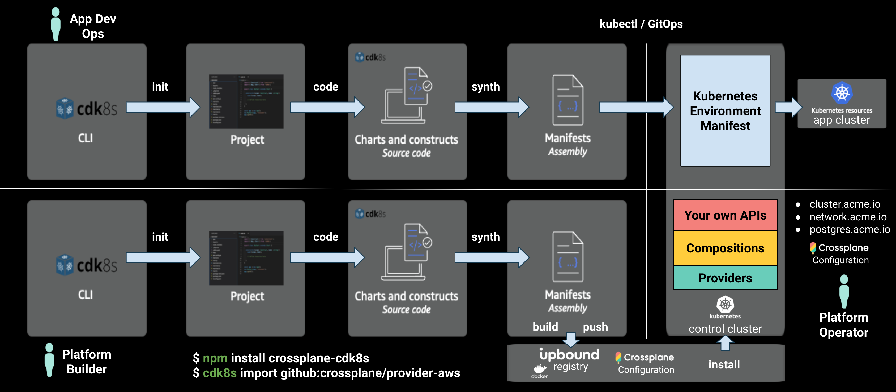
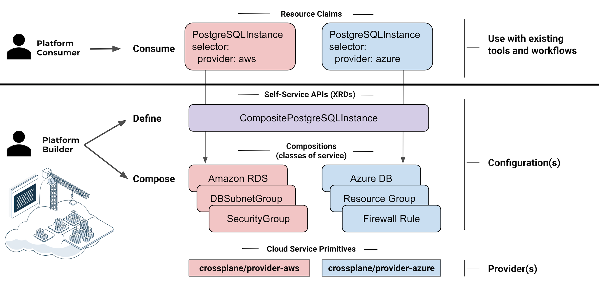
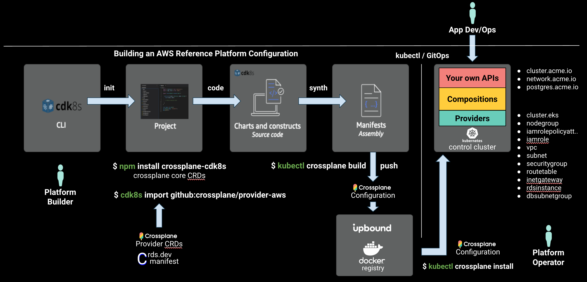
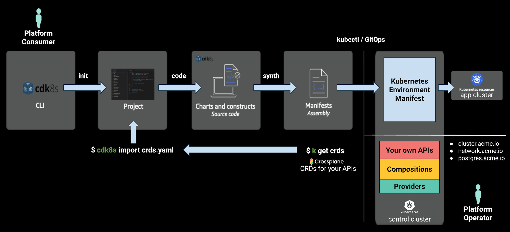

# crossplane-cdk8s (experimental)

Compose your own cloud APIs in Kubernetes using familiar languages including TypeScript, Python, and Java.

## Contents

* [Overview](#overview)
* [Getting Started](#getting-started)
  * [Build your own Platform Configuration](#build-your-own-platform-configuration)
    * [Init](#init)
    * [Import](#import)
    * [Code](#code)
    * [Synth](#synth)
    * [Package](#package)
    * [Push](#push)
  * [Operate Platform](#operate-platform)
    * [Install](#install)
    * [Connect](#connect)
    * [Share](#share)
  * [Consume Platform](#consume-platform)
    * [Provision](#provision)
    * [Cleanup](#cleanup)
  * [Uninstall](#uninstall)
* [API Docs](#api-docs)
* [Learn More](#learn-more)

## Overview

Kubernetes was designed for extensibility and projects like [Crossplane](https://crossplane.io) have enabled you to define cloud API abstractions in idiomatic Kubernetes YAML, but what if you’re more familiar with TypeScript, Python, or Java? If managing YAML indentation has you down, is there a better way to define CRDs and composite resources that capture your infrastructure best practices and to dynamically generate subnets, CIDR ranges, and more -- without writing complex controllers in Go?

`crossplane-cdk8s` is a multi-language toolkit with high level abstractions for authoring [Crossplane](https://crossplane.io) Platform `Configurations` using [cdk8s](https://cdk8s.io):

* `Configuration` package metadata
* `CompositeResourceDefinitions` (`XRDs`) define the platform's self-service APIs - e.g. `CompositePostgreSQLInstance`
* `Compositions` offer the classes-of-service supported for each self-service API - e.g. `Standard`, `Performance`, `Replicated`

`Compositions` use imported cloud service primitives from a variety of Crossplane `Providers` documented on [docs.crds.dev](https://doc.crds.dev).

The examples in this repository are a starting point to build your own
internal cloud platform for use with [Upbound Cloud](https://upbound.io) or
any self-hosted Crossplane instance. They are written entirely in languages like
TypeScript using:

* `crossplane-cdk8s` high level abstractions for - `CompositeResourceDefinitions`, `Compositions`, `Configurations`
* imported cloud service primitives - `cdk8s import github:crossplane/provider-aws`
* `cdk8s` tooling

To build and consume your internal cloud platform, `cdk8s` can be used by:

* `Platform Builders` - to author Crossplane Platform `Configurations` that vend a set of cloud APIs for teams to self-service
* `Platform Consumers` - to provision resources from the self-service API



The `PostgreSQLInstance` example in [charts/postgres.ts](https://github.com/crossplane-contrib/crossplane-cdk8s/blob/master/examples/typescript/acme-platform-aws/charts/postgres.ts) defines a self-service API with the following:

* `CompositeResourceDefinition` (`XRD`) - defines your API schema and generates CRDs for:
  * `PostgresSQLInstance` - claim kind
  * `CompositePostgreSQLInstance` - composite kind
* `Composition` - to serve a class-of-service for an API, composed of the following resources:
  * `RDSInstance`
  * `DBSubnetGroup`

Applying these resources to your `Control Cluster` vends a set of cloud APIs that extend the Kubernetes API:


### APIs in the Example AWS Platform Configuration

* `Cluster` (API)- provision a fully configured EKS cluster
  * Composed resources:
    * `EKSCluster`
    * `NodeGroup`
    * `IAMRole`
    * `IAMRolePolicyAttachment`
    * `HelmReleases` for Prometheus and other cluster services.
* `Network` (API) - fabric for a `Cluster` to securely connect to Data Services and
  the Internet.
  * Composed resources:
    * `VPC`
    * `Subnet`
    * `InternetGateway`
    * `RouteTable`
    * `SecurityGroup`
* `PostgreSQLInstance` (API) - provision a PostgreSQL RDS instance that securely connects to a `Cluster`
  * Composed resources:
    * `RDSInstance`
    * `DBSubnetGroup`

See the [Crossplane AWS Provider CRD Docs](https://doc.crds.dev/github.com/crossplane/provider-aws) for the AWS cloud service primitives used in the example.

Learn more about `Composition` in the [Crossplane
Docs](https://crossplane.github.io/docs).

## Getting Started

The workflow to author Crossplane Platform `Configurations` in TypeScript:



## Build your own Platform Configuration

### Init

Let's get our project setup and initialized!

#### Install cdk8s CLI

The cdk8s CLI is used to `init` our project, `import` CRDs, and `synth` the manifest YAML.

```console
npm install -g cdk8s-cli
```

#### Install Crossplane CLI

Crossplane provides a CLI to `build`, `push`, and `install` packages for Crossplane `Configurations` and `Providers`.

```console
curl -sL https://raw.githubusercontent.com/crossplane/crossplane/release-1.0/install.sh | sh
sudo mv kubectl-crossplane /usr/local/bin
```

#### Init Project

Generate a new project with `cdk8s init` or [projen](https://github.com/projen/projen):

```console
mkdir project
cd project

cdk8s init typescript-app
```

#### Install crossplane-cdk8s

```console
npm install crossplane-cdk8s
```

### Import

Import cloud service primitives from Crossplane Providers.

For example edit the `cdk8s.yaml` to include a `github:crossplane/provider-aws` stanza:

```yaml
language: typescript
app: node main.js
imports:
  - k8s
  - github:crossplane/provider-aws
```

Then re-run the `import` command:

```console
cdk8s import
```

Any project known to [doc.crds.dev](https://doc.crds.dev/) can be imported with the `cdk8s import github:account/repo[@VERSION]` command.

### Code

A [Crossplane](https://crossplane.io) Platform `Configuration` requires the following:

* `Configuration` package metadata
* `CompositeResourceDefinitions` (`XRDs`) define the platform's self-service APIs
* `Compositions` offer classes-of-service for each self-service API

In `examples/typescript/acme-platform-aws` these resource are bundled into the following cdk8s `Charts`:

* [charts/config.ts](https://github.com/crossplane-contrib/crossplane-cdk8s/blob/master/examples/typescript/acme-platform-aws/charts/config.ts) - `Configuration` package metadata
* [charts/postgres.ts](https://github.com/crossplane-contrib/crossplane-cdk8s/blob/master/examples/typescript/acme-platform-aws/charts/postgres.ts) - `XRD` and `Composition`
* [charts/cluster.ts](https://github.com/crossplane-contrib/crossplane-cdk8s/blob/master/examples/typescript/acme-platform-aws/charts/cluster.ts) - `XRD` and `Composition`
* [charts/network.ts](https://github.com/crossplane-contrib/crossplane-cdk8s/blob/master/examples/typescript/acme-platform-aws/charts/network.ts) - `XRD` and `Composition`

Each `Chart` emits a separate YAML file.

[main.ts](https://github.com/crossplane-contrib/crossplane-cdk8s/blob/master/examples/typescript/acme-platform-aws/main.ts) adds these `Charts` to a cdk8s `App` called `pkg` and calls `synth()` to render the YAML files:

```ts
import { App } from 'cdk8s';
import { ClusterChart } from './charts/cluster';
import { ConfigurationChart } from './charts/config';
import { NetworkChart } from './charts/network';
import { PostgresChart } from './charts/postgres';

const pkg = new App();

new ConfigurationChart(pkg, 'crossplane');
new ClusterChart(pkg, 'cluster-api');
new NetworkChart(pkg, 'network-api');
new PostgresChart(pkg, 'postgres-api');

pkg.synth();

```

When `cdk8s synth` is called it executes the `app` defined in the [cdk8s.yaml](https://github.com/crossplane-contrib/crossplane-cdk8s/blob/master/examples/typescript/acme-platform-aws/cdk8s.yaml):

```yaml
app: node main.js
```

You can change the `app` command to whatever you like, for example:

```yaml
app: npx ts-node main.ts
```

#### Configuration (Package Metadata)

[charts/config.ts](https://github.com/crossplane-contrib/crossplane-cdk8s/blob/master/examples/typescript/acme-platform-aws/charts/config.ts) - `Configuration` package metadata

```ts
const config = new crossplane.Configuration(this, 'config', {
  name: 'acme-platform-aws',
  company: 'Upbound',
  maintainer: 'Phil Prasek <phil@upbound.io>',
  keywords: ['aws', 'cloud-native', 'kubernetes', 'example', 'platform', 'reference'],
  source: 'github.com/crossplane-contrib/crossplane-cdk8s/examples/typescript/acme-platform-aws',
  license: 'Apache-2.0',
  descriptionShort: 'An example AWS platform for Kubernetes and Data Services.',
  description: 'An example AWS platform for Kubernetes and Data Services.'
  readme: fromResource('readme.md'),
  crossplaneVersion: '>=v1.0.0-0',
  iconData: fromResource('icon.txt'),
});

config.addProvider('registry.upbound.io/crossplane/provider-aws', '>=v0.14.0-0');
config.addProvider('registry.upbound.io/crossplane/provider-helm', '>=v0.3.6-0');
```

#### CompositeResourceDefinition (XRD)

[charts/postgres.ts](https://github.com/crossplane-contrib/crossplane-cdk8s/blob/master/examples/typescript/acme-platform-aws/charts/postgres.ts) - `CompositeResourceDefinition`

```ts
const xrd = new crossplane.CompositeResourceDefinition(this, 'xrd', {
  name: 'compositepostgresqlinstances.aws.platform.acme.io',
});

xrd.group('aws.platform.acme.io');
xrd.claimKind('PostgreSQLInstance').plural('postgresqlinstances');
xrd.kind('CompositePostgreSQLInstance').plural('compositepostgresqlinstances');
xrd.connectionSecret().key('username').key('password').key('endpoint').key('port');

xrd.version('v1alpha1').served().referencable().spec().with(crossplane.Prop.for({ object: (spec) => {
  spec.uiSection( {
    title: 'Database Size',
    description: 'Enter information to size your database',
  });

  spec.propObject('parameters').required().with(crossplane.Prop.for({ object: (params) => { 
    params.propInteger('storageGB').required().min(1).max(500)
      .description('GB of storage for your database')
      .uiInput({
        title: 'Storage (GB)',
        default: 5,
      });
    // ...
  }}));
}}));
```

#### Composition

[charts/postgres.ts](https://github.com/crossplane-contrib/crossplane-cdk8s/blob/master/examples/typescript/acme-platform-aws/charts/postgres.ts) - `Composition`

```ts
const composition = new crossplane.Composition(this, 'postgres-composition', xrd, {
  name: 'compositepostgresqlinstances.aws.platform.acme.io',
  metadata: {
    labels: {
      provider: 'aws',
    },
  },
});

composition.addResource(db.DbSubnetGroup.manifest({
  spec: {
    forProvider: {
      region: 'us-west-2',
      description: 'An excellent formation of subnetworks.',
    },
    deletionPolicy: db.DbSubnetGroupSpecDeletionPolicy.DELETE,
}}))
.mapFieldPath(xrdNetRef!.meta.path, 'spec.forProvider.subnetIdSelector.matchLabels[networks.aws.platform.acme.io/network-id]');

composition.addResource(db.RdsInstance.manifest({
  spec: {
    forProvider: {
      region: 'us-west-2',
      dbSubnetGroupNameSelector: {
        matchControllerRef: true,
      },
      dbInstanceClass: 'db.t2.small',
      masterUsername: 'masteruser',
      engine: 'postgres',
      engineVersion: '9.6',
      skipFinalSnapshotBeforeDeletion: true,
      publiclyAccessible: false,
    },
    writeConnectionSecretToRef: {
      namespace: 'crossplane-system',
      name: 'default-db-conn',
    },
    deletionPolicy: db.RdsInstanceSpecDeletionPolicy.DELETE,
}}))
.mapFieldPathXFormStringFormat('metadata.uid', '%s-postgresql', 'spec.writeConnectionSecretToRef.name')
// ...
.connectionDetailsFromXrd();
```

### Synth

Build and generate the YAML manifests for the Platform `Configuration`:

```console
npm run build
```

This compiles the project and runs the `cdk8s synth` command, which can also be run directly:

```console
cdk8s synth
```

This will generate one or more YAML files in the `dist` directory, for example:

* `dist/project.k8s.yaml`

However until you add `Charts` to your `main.ts` the `cdk8s synth` output will be
empty, so let's switch to the `acme-platform-aws` example.

#### Build and Synth: `examples/typescript/acme-platform-aws`

```console
git clone https://github.com/crossplane-contrib/crossplane-cdk8s.git

yarn install

yarn build
```

this should generate `dist` output for:

* examples/typescript/acme-platform-aws-consumer
* examples/typescript/acme-platform-aws

For example:

```console
npx: installed 9 in 1.378s
dist/cluster-api.k8s.yaml
dist/crossplane.k8s.yaml
dist/network-api.k8s.yaml
dist/postgres-api.k8s.yaml
```

### Package

Create a Crossplane Configuration package:

```console
cd examples/typescript/acme-platform-aws

kubectl crossplane build configuration --name package.xpkg -f ./dist
```

### Push

Push the `Configuration` package to a container registry.

Use the free Upbound Registry, which displays complete `Configuration` package metadata:

1. Sign up for a free [Upbound Cloud](https://cloud.upbound.io/register) account.
1. Create an `Organization` for your teams.
1. Create a `Repository` called `acme-platform-aws` in your `Organization`

Set these to match your continer registry settings:

```console
ACCOUNT=acme
ACCOUNT_EMAIL=me@acme.io
REPO=acme-platform-aws
VERSION_TAG=v0.2.3
REGISTRY=registry.upbound.io
PLATFORM_CONFIG=${REGISTRY:+$REGISTRY/}${ACCOUNT}/${REPO}:${VERSION_TAG}
```

Login to your container registry.

```console
docker login ${REGISTRY} -u ${ACCOUNT_EMAIL}
```

Push package to your container registry:

```console
kubectl crossplane push configuration ${PLATFORM_CONFIG} -f dist/package.xpkg
```

### Operate Platform

#### Install

Create a `Control Cluster` with Crossplane installed.

If using [Upbound Cloud](https://upbound.io):

* Create an Upbound Cloud `Platform` that includes a hosted Crossplane instance:
  1. Sign up for [Upbound Cloud](https://cloud.upbound.io/register).
  1. Create an `Organization` for your teams.
  1. Create a `Platform` in Upbound Cloud (e.g. dev, staging, or prod).
  1. [Connect](https://cloud.upbound.io/docs/getting-started/connect-to-your-platform)
  `kubectl` to your `Platform` instance.

If using self-hosted Crossplane:

* Create a self-hosted Crossplane instance using the [crossplane.io/docs](https://crossplane.io/docs)

Install package into `Control Cluster`:

```console
kubectl crossplane install configuration ${PLATFORM_CONFIG}
```

Check install status:

```console
kubectl get pkg
```

It should show:

```console
NAME                                                      INSTALLED   HEALTHY   PACKAGE                                              AGE
configuration.pkg.crossplane.io/prasek-acme-platform-aws   True        True      registry.upbound.io/prasek/acme-platform-aws:v0.2.0   2m8s

NAME                                                  INSTALLED   HEALTHY   PACKAGE                                               AGE
provider.pkg.crossplane.io/crossplane-provider-aws    True        True      registry.upbound.io/crossplane/provider-aws:v0.16.0   107s
provider.pkg.crossplane.io/crossplane-provider-helm   True        True      registry.upbound.io/crossplane/provider-helm:v0.5.0   101s
```

#### Connect

Connect the `Control Cluster` to your Cloud Provider.

Create `ProviderConfig` and `Secret`

```console
AWS_PROFILE=default && echo -e "[default]\naws_access_key_id = $(aws configure get aws_access_key_id --profile $AWS_PROFILE)\naws_secret_access_key = $(aws configure get aws_secret_access_key --profile $AWS_PROFILE)" > creds.conf

kubectl create secret generic aws-creds -n crossplane-system --from-file=key=./creds.conf

kubectl apply -f hack/aws-default-provider.yaml

rm creds.conf
```

See [crossplane.io/docs](https://crossplane.io/docs) for how to connect Azure, GCP, Alibaba and more.

#### Share

**Important**: the examples in this guide use `team1` as their `Workspace` / `Namespace`.

If using [Upbound Cloud](https://upbound.io):

1. Invite App Teams to your Organization in Upbound Cloud.
1. Create a team `Workspace` in Upbound Cloud, named `team1`.
1. Enable self-service APIs in each `Workspace`.
1. Invite app team members and grant access to `Workspaces` in one or more
      `Platforms`.

If using self-hosted Crossplane:

1. Ensure you've installed Crossplane with [the RBAC manager enabled](https://github.com/crossplane/crossplane/blob/master/design/design-doc-rbac-manager.md#opting-out-of-rbac-management) (default).
1. Create a Kubernetes `Namespace` called `team1`.
1. Annotate the `Namespace` for `team1` as outlined [here](https://github.com/crossplane/crossplane/blob/master/design/design-doc-rbac-manager.md#composite-resource-clusterrole-mechanics) for each claim kind you want to enable.

### Consume Platform

#### Provision

Once installed and configured the Platform can be consumed by creating claim resources in a given `Namespace` using `kubectl`, GitOps, or anything that works with the Kubernetes API. `Platform Consumers` can keep using existing tools and workflows.

For example:

```yaml
apiVersion: "aws.platform.acme.io/v1alpha1"
kind: "Network"
metadata:
  name: "dev-env-network-c89a128d"
  namespace: "team1"
spec:
  clusterRef:
    id: "acme-platform-aws-cluster"
  id: "acme-platform-aws-network"
---
apiVersion: "aws.platform.acme.io/v1alpha1"
kind: "Cluster"
metadata:
  name: "dev-env-cluster-c81d06d0"
  namespace: "team1"
spec:
  id: "acme-platform-aws-cluster"
  parameters:
    networkRef:
      id: "acme-platform-aws-network"
    nodes:
      count: 3
      size: "small"
    services:
      operators:
        prometheus:
          version: "10.0.2"
  writeConnectionSecretToRef:
    name: "acme-platform-aws-cluster"
---
apiVersion: "aws.platform.acme.io/v1alpha1"
kind: "PostgreSQLInstance"
metadata:
  name: "dev-env-database-c8a2b064"
  namespace: "team1"
spec:
  parameters:
    networkRef:
      id: "acme-platform-aws-network"
    storageGB: 20
  writeConnectionSecretToRef:
    name: "my-db-conn"
```

However, `cdk8s` can also be used by `Platform Consumers` to generate the YAML above with this workflow:



Get access to your team `Workspace` / `Namespace`:

If using [Upbound Cloud](https://upbound.io):

* Join your Organization in Upbound Cloud:

  1. Join your [Upbound Cloud](https://cloud.upbound.io/register) `Organization`
  1. Verify access to your team `Workspaces`
  1. [Connect](https://cloud.upbound.io/docs/getting-started/connect-to-your-platform) `kubectl` to the `team1` `Workspace`

If using self-hosted Crossplane:

* Get `Namespace` connect info from your cluster admin.

Ensure you're in the `acme-platform-aws-consumer` directory:

```console
git clone https://github.com/crossplane-contrib/crossplane-cdk8s.git

cd crossplane-cdk8s/examples/typescript/acme-platform-aws-consumer
```

Import CRDs from control cluster:

```console
cdk8s import crds.yaml
```

which should result in:

```console
aws.platform.acme.io
  aws.platform.acme.io/cluster
  aws.platform.acme.io/network
  aws.platform.acme.io/postgresqlinstance
```

```ts
import { App, Chart } from 'cdk8s';
import { Construct } from 'constructs';
import * as acme from './imports/aws.platform.acme.io';

class MyChart extends Chart {
  constructor(scope: Construct, id: string) {
    super(scope, id, {
      namespace: 'team1',
    });

    const clusterId = 'acme-platform-aws-cluster';
    const networkId = 'acme-platform-aws-network';

    new acme.Network(this, 'network', {
      spec: {
        id: networkId,
        clusterRef: { id: clusterId },
      },
    });

    new acme.Cluster(this, 'cluster', {
      spec: {
        id: clusterId,
        parameters: {
          nodes: {
            count: 3,
            size: acme.ClusterSpecParametersNodesSize.SMALL,
          },
          services: {
            operators: {
              prometheus: { version: '10.0.2' },
            },
          },
          networkRef: { id: networkId },
        },
        writeConnectionSecretToRef: { name: clusterId },
      },
    });


    new acme.PostgreSqlInstance(this, 'database', {
      spec: {
        parameters: {
          storageGB: 20,
          networkRef: { id: networkId },
        },
        writeConnectionSecretToRef: {
          name: 'my-db-conn',
        },
      },
    });
  }
}

const app = new App();
new MyChart(app, 'dev-env');

app.synth();
```

Synth the manifest

```console
cdk8s synth                                 
```

which should result in:

```console
npx: installed 9 in 1.141s
dist/dev-env.k8s.yaml
```

Apply the claim resources to provision a Kubernetes app cluster with secure networking and attached RDS database:

```console
kubectl apply -f dist/dev-env.k8s.yaml
```

which should result in:

```console
cluster.aws.platform.acme.io/eks-cluster created
network.aws.platform.acme.io/network-fabric created
postgresqlinstance.aws.platform.acme.io/postgres-instance created
```

Verify status:

```console
kubectl get claim -n team1
kubectl get composite
kubectl get managed
```

to check progress:

```console
kubectl get managed
```

After a few minutes the resources should be provisioned:

```console
NAME                                                             READY   SYNCED   ID                     VPC                     AGE
securitygroup.ec2.aws.crossplane.io/network-fabric-g2j2c-cn2f6   True    True     sg-06d9fcce822146d21   vpc-0652443832c846e2b   16m

NAME                                                               READY   SYNCED   ID                      VPC                     AGE
internetgateway.ec2.aws.crossplane.io/network-fabric-g2j2c-vkpjc   True    True     igw-0a962c5c3b49455a5   vpc-0652443832c846e2b   17m

NAME                                                   READY   SYNCED   ID                      CIDR             AGE
vpc.ec2.aws.crossplane.io/network-fabric-g2j2c-sdhhk   True    True     vpc-0652443832c846e2b   192.168.0.0/16   17m

NAME                                                      READY   SYNCED   ID                         VPC                     CIDR               AGE
subnet.ec2.aws.crossplane.io/network-fabric-g2j2c-c6ssg   True    True     subnet-0aa8ca74573f003be   vpc-0652443832c846e2b   192.168.0.0/18     16m
subnet.ec2.aws.crossplane.io/network-fabric-g2j2c-h8wsr   True    True     subnet-021a453c2a7fe6630   vpc-0652443832c846e2b   192.168.64.0/18    16m
subnet.ec2.aws.crossplane.io/network-fabric-g2j2c-hm5c4   True    True     subnet-00d5bb3be64f515e3   vpc-0652443832c846e2b   192.168.128.0/18   16m
subnet.ec2.aws.crossplane.io/network-fabric-g2j2c-qhlg9   True    True     subnet-083342ec3e4535375   vpc-0652443832c846e2b   192.168.192.0/18   16m

NAME                                                          READY   SYNCED   ID                      VPC                     AGE
routetable.ec2.aws.crossplane.io/network-fabric-g2j2c-jrklg   True    True     rtb-08652a83ea56abc20   vpc-0652443832c846e2b   16m

NAME                                                    READY   SYNCED   AGE
cluster.eks.aws.crossplane.io/eks-cluster-dfqpc-lkm2w   True    True     16m

NAME                                                      READY   SYNCED   CLUSTER                    AGE
nodegroup.eks.aws.crossplane.io/eks-cluster-dfqpc-xsrwl   True    True     acme-platform-aws-cluster   16m

NAME                                                         READY   SYNCED   AGE
iamrole.identity.aws.crossplane.io/eks-cluster-dfqpc-258d5   True    True     17m
iamrole.identity.aws.crossplane.io/eks-cluster-dfqpc-sg5zc   True    True     17m

NAME                                                                         READY   SYNCED   ROLENAME                  POLICYARN                                                    AGE
iamrolepolicyattachment.identity.aws.crossplane.io/eks-cluster-dfqpc-6rp7s   True    True     eks-cluster-dfqpc-258d5   arn:aws:iam::aws:policy/AmazonEC2ContainerRegistryReadOnly   16m
iamrolepolicyattachment.identity.aws.crossplane.io/eks-cluster-dfqpc-hmqxc   True    True     eks-cluster-dfqpc-258d5   arn:aws:iam::aws:policy/AmazonEKS_CNI_Policy                 16m
iamrolepolicyattachment.identity.aws.crossplane.io/eks-cluster-dfqpc-plbvj   True    True     eks-cluster-dfqpc-sg5zc   arn:aws:iam::aws:policy/AmazonEKSClusterPolicy               17m
iamrolepolicyattachment.identity.aws.crossplane.io/eks-cluster-dfqpc-v4zrh   True    True     eks-cluster-dfqpc-258d5   arn:aws:iam::aws:policy/AmazonEKSWorkerNodePolicy            16m

NAME                                                                     READY   SYNCED   AGE
dbsubnetgroup.database.aws.crossplane.io/postgres-instance-jx4gv-dkfdc   True    True     17m

NAME                                                                   READY   SYNCED   STATE       ENGINE     VERSION   AGE
rdsinstance.database.aws.crossplane.io/postgres-instance-jx4gv-kp857   True    True     available   postgres   9.6.19    17m
```

#### Cleanup

Cleanup resources:

```console
kubectl delete -f dist/dev-env.k8s.yaml
```

which should result in the `claims` being deleted:

```console
cluster.aws.platform.acme.io "eks-cluster" deleted
network.aws.platform.acme.io "network-fabric" deleted
postgresqlinstance.aws.platform.acme.io "postgres-instance" deleted
```

Verify all underlying resources have been cleanly deleted:

```console
kubectl get managed
```

which after a few minutes should report:

```console
No resources found
```

#### Uninstall

Uninstall Platform Configuration:

```console
kubectl delete configuration.pkg --all

kubectl get configuration.pkg
```

Uninstall Providers:

```console
kubectl delete provider.pkg --all

kubectl get provider.pkg
```

#### Uninstall Crossplane kubectl plugin

```console
rm /usr/local/bin/kubectl-crossplane*
```

## API Docs

See [API Docs](https://github.com/crossplane-contrib/crossplane-cdk8s/blob/master/API.md).

## Learn More

If you're interested in building your own internal cloud platform for your
company, we'd love to hear from you and chat. You can setup some time with us
at info@upbound.io. For Crossplane questions, join [slack.crossplane.io](https://slack.crossplane.io), and say hi on the [#cdk8s-integration](https://crossplane.slack.com/archives/C019ASMR5B6) channel!
